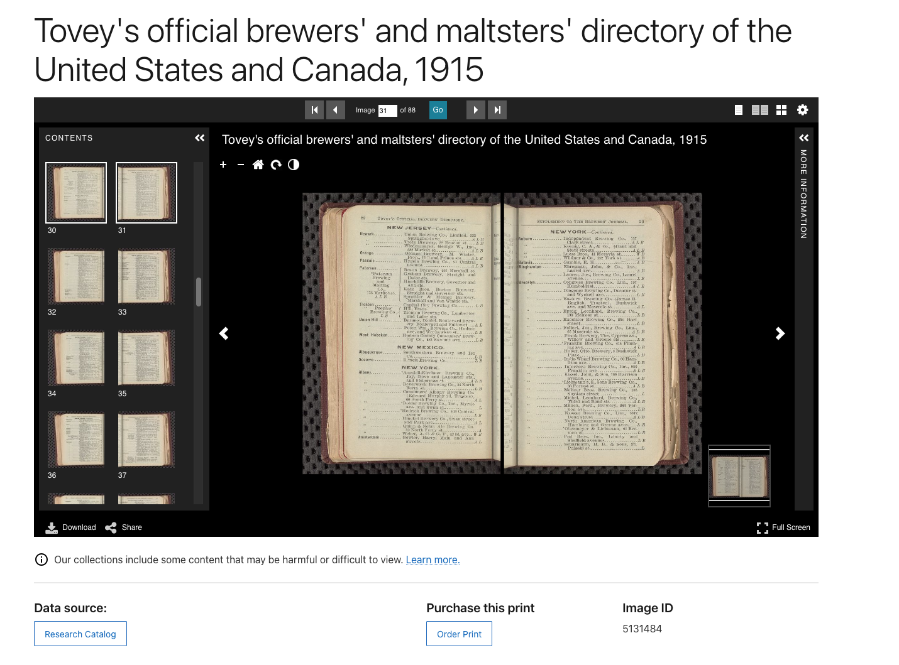
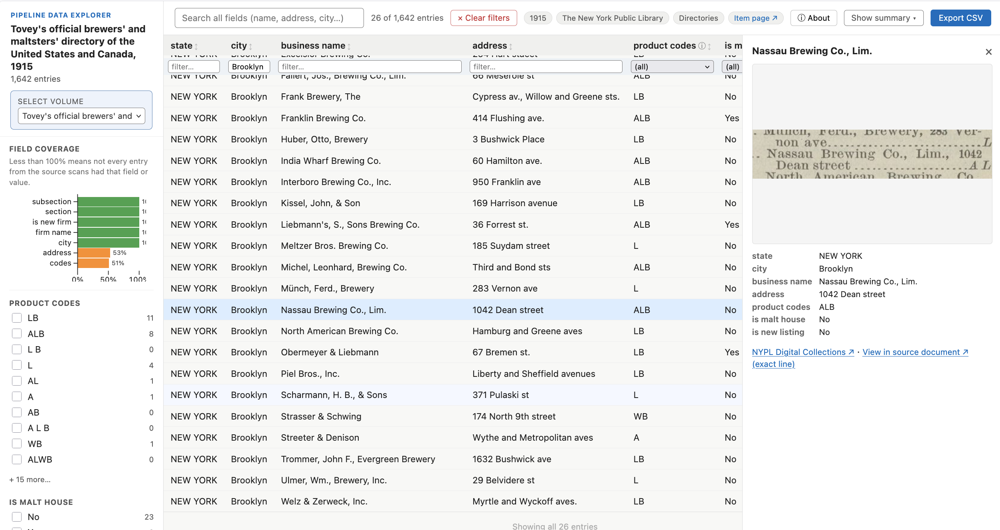

# Directory Pipeline 
**(A personal digital collections project)**


<br>

**2026-09-13**
**All Eyes on AI for LAMs: IIIF & IIPC**

Josh Hadro
josh.hadro@gmail.com

---


---


## What the pipeline does

Takes any item with [a IIIF manifest](https://iiif.io/get-started/how-iiif-works/) and runs through a human-in-the-loop, Large Language Model (LLM)-augmented set of steps with meta-prompting to produce structured data with minimal customization required.

**The primary output:** An HTML/JS table viewer (the Data Explorer) with one row per entry in the source material, including images of the location of the entry on the page and a link back to the originating digital object.

---



---




---

## Top takeaways — what's new here for digital collections?
- Meta-prompting strategy for custom, item-specific OCR and NER prompts based on sample pages
- Two-pass consensus OCR strategy: old tech for bounding boxes, LLMs for higher-quality OCR, matched via alignment step
    - A critical guard against hallucinations

---

### The pipeline
IIIF Manifest  
→ Download files 
→ Select sample pages* 
→ Generate OCR + NER prompts 
→ Run LLM OCR 
→ Run layout detection 
→ Match lines 
→ Review alignment*  
→ Extract aligned entry data (linked to IIIF coordinates)


<br><br><sub>* denotes "human in the loop" step, through Pipeline interface</sub>

---

### Then the fun stuff
- Data explorer
- Map interface (after geocoding enrichment)
- Cross-volume comparison
- And more!

---

## Example outputs

- [The Green Books + Other Travel Guide Explorer (1930-1966)](https://hadro.github.io/green-books/all-volumes)
    - N.B. Lots of design elements layered onto this data explorer

- [Date Explorer for 19th Century brewery guides, extracted from a brewery guide](https://hadro.github.io/brewery-guides/explorer#about)
    - Closer to raw wireframe output


- [An exploration tool for data from the Polk-Hoffhine Tulsa City Directory, 1921](https://hadro.github.io/tulsa-city-directories/1921#about)


---


---

Every entry links to its exact location on the page.


---

IIIF viewer that zooms directly to the entry in context


----
Cross-volume views


---

A New York City map version


---

# Appendices


---

## Human-in-the-loop interface examples

---


---


---


---


---


## Thesis

The tradeoffs have shifted.

For digitized collections:
- Data extraction with computers used to be impossible.
- Then it was doable, but hard and expensive, and not that useful. 
- Then it was doable, and relatively cheap, but useful only in narrow circumstances. 

Now, I think we're on the cusp of doable, cheap, and broadly useful. 

---

## How I think about this

The baseline I'm evaluating against isn't "is this perfect" (OCR is far from perfect!). It's "is this still useful, despite known flaws." For OCR, we answered that question affirmatively decades ago. I think the answer for some collections materials in the library sector, informed by these kinds of enrichments, is getting close to yes.


---

### Meta-prompting for item-specific extraction guidance

```md
You are a structured data extractor for a digitized historical 
document. Your goal is to identify and extract discrete records 
from the transcribed text of "The National Directory of 
Morticians," a professional registry of funeral homes and 
directors organized by geography.
```
---
```markdown
## Your task
### Entry schema
Each object in the "entries" array must represent a single 
business or practitioner. Inherit the geographic context from the 
headings above the entry. Use the following fields:

- state: The state name (normalized, e.g., "ALABAMA").
- city: The city name.
- county: The county name (e.g., "Henry Co.").
- city_population: The population count listed for that city.
- business_name: The primary name of the funeral home or mortuary.
- personnel: Names of specific directors, managers, or partners 
mentioned (e.g., "Bernie T. Hoff, Mgr.").
```

---

```markdown

## Rules

1. Extract every distinct funeral service provider listed. If a 
boxed advertisement and a text listing refer to the same 
business, merge them into a single entry containing all available 
details.
2. Skip page numbers, running headers, and decorative elements. 
Ignore generic directory filler text (e.g., "Use National 
Directory of Morticians for Accuracy") and "Publishers Notes."
3. Normalize headings: If a heading appears as 
"ARIZONA—Continued", record the state as "ARIZONA".
4. Heading transitions mid-page: When a new City/County heading 
appears (e.g., "BIRMINGHAM—Jefferson Co."), every entry following 
it belongs to that new context. The prior_context only applies to 
entries appearing before the first heading change on the current 
page.
5. If a record spans a page boundary, extract the portion of the 
record present on the current page. If a listing says "(See Ad. 
next page)", include that note in the address or a notes field.
6. Sentinel tokens: If the source text contains [illegible] or 
[blank], copy those tokens verbatim. If a field is simply not 
present, leave it as null or an empty string.

Return only valid JSON. No markdown code fences. No explanatory 
text.
```


---


## Pipeline actors

### What a **human** is doing in this pipeline

- Bringing curiosity to bear
- Exhibiting agency and responsibility
- Employing materials judgement and expertise
- Model selection
- Prompt review
- QA: OCR quality, alignment review, gut check etc.
- Synthesizing, understanding, and getting excited about possibilities

---
## Pipeline actors

### What an **LLM** is doing in this pipeline
- Meta-prompting for prompt-generation (OCR, NER)
- Item-specific OCR extraction
- Handwriting detection 
- Item-specific data extraction

---
## Pipeline actors

### What a **plain old computer** is doing in this pipeline
- File management
- Spread detection (.e.g., microfilm with 2-up pages)
- Column detection
- Layout analysis
- Bounding box identification
- Outlier detection
- LLM OCR to bounding box alignment
- IIIF annotation and content state generation


<!-- ---

## What vibe coding enabled, and what it didn't

Paul Ford, on [vibe coding](https://www.nytimes.com/2026/02/18/opinion/ai-software.html?unlocked_article_code=1.V1A.OOea.4QQ9xxw6vlue&smid=url-share): 

>  [Claude Code] was always a helpful coding assistant, but in November it suddenly got much better, and ever since I’ve been knocking off side projects that had sat in folders for a decade or longer.

For me, the recent spate of tools have meant sustained attention on personal projects that previously languished sometimes for a literal decade.

Put another way: I probably could have always done something sort of like this ... but I was never going to.


---

## Where should this pipeline go next?

### What kinds of things might this unlock? 
 -->

---

## Useful links: 

Code repository: https://github.com/hadro/directory-pipeline 


---
N.B. Gemini and similar API models are currently the best mix of quality and value for OCR/HTR and NER, but nearly all of these things could likely be done locally with tools like Surya/Chandra and models like Qwen 3.5, removing the paid API aspect of this.


---

## Readings

These links substantially inspired my interest in this project: 
- [Multimodal LLMs for OCR, OCR Post-Correction, and Named Entity Recognition in Historical Documents](https://arxiv.org/abs/2504.00414)
- [Gemini 3 Solves Handwriting Recognition and it’s a Bitter Lesson](https://generativehistory.substack.com/p/gemini-3-solves-handwriting-recognition)
- [The A.I. Disruption We’ve Been Waiting for Has Arrived](https://www.nytimes.com/2026/02/18/opinion/ai-software.html?unlocked_article_code=1.V1A.OOea.4QQ9xxw6vlue&smid=url-share)

---

## AI Disclosure

Claude Code wrote: 
- Most of the code for this project
- Most of the code and git repo documentation for this project 

I wrote:
- Some small amount of the code for this project
- Amendments and edits of the documentation 

I also wrote all of the material for this presentation — no AI was used in these slides (for better or for worse)